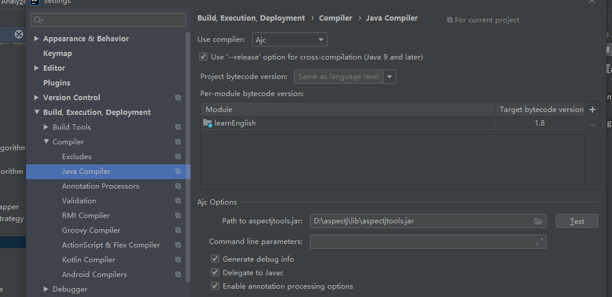
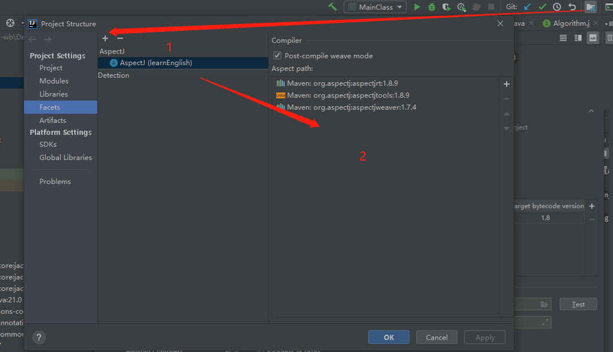

**1. 使用idea编译运行请先配置aspectj编译器运行**
`https://blog.csdn.net/gavin_john/article/details/80156963`
`https://blog.csdn.net/thing15636/article/details/105165946/`

`编译器安装资源:compiler/aspectj-DEVELOPMENT-201901140838.jar 双击安装即可`

**2. idea配置截图**

``
注意每次跑如果没有在资源目录下生成errorWordsRecord.txt.就需要检查自己的编译器配对没有
``

**3. 功能介绍**

    - 目前运行流程是默认通过读取资源目录learn.xls文件来生成待测试的单词集合,后面会支持自定义文件,目前留了一个口子
    - 运行时首先设定一个测试的期间.然后会测试指定期间中的单词,目前这块还待优化,每次输入期间很费力
    - 根据console的结果输入y | n | :q,:q后者是退出程序运行
    - 输入的n会被重复考核,直到dto中对应errorTime为0,这个单词不再进入状态机
    - 程序会将错误的单词集合搜集起来,搜集到资源目录的errorWordsRecord.txt中做一次持久化,后面再次运行主函数的时候会默认读取里面json字符串拼到要本次期间的单词集合中.默认设定的errorTime是3.后面这块逻辑会被优化.目前只是支持了一次持久化.
    
**4. 启动**
``配置好ajc编译器后运行主函数即可com.learn.main.MainClass``

